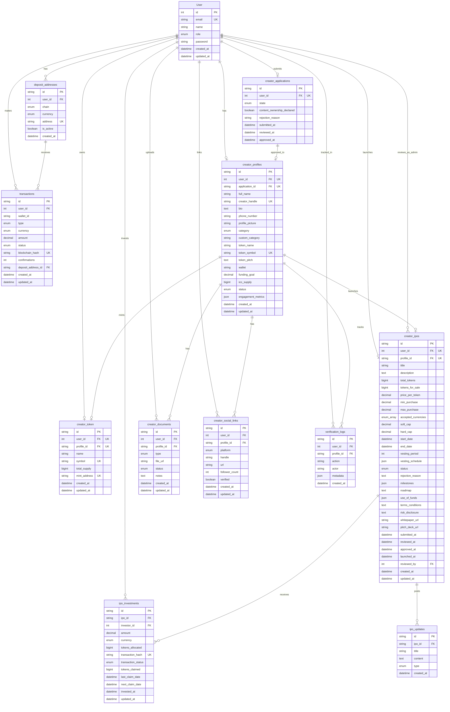

# Database ER diagram


```mermaid
erDiagram
    User ||--o{ deposit_addresses : "has"
    User ||--o{ transactions : "makes"
    User ||--o{ ipo_investments : "invests"
    User ||--o| creator_profiles : "has"
    User ||--o| creator_applications : "submits"
    User ||--o| creator_token : "owns"
    User ||--o| creator_ipos : "launches"
    User ||--o{ creator_documents : "uploads"
    User ||--o{ creator_social_links : "links"
    User ||--o{ verification_logs : "tracked_in"
    User ||--o{ creator_ipos : "reviews_as_admin"

    creator_applications ||--o| creator_profiles : "approved_to"
    
    creator_profiles ||--o{ creator_documents : "has"
    creator_profiles ||--o{ creator_social_links : "has"
    creator_profiles ||--o{ verification_logs : "tracks"
    creator_profiles ||--o| creator_token : "mints"
    creator_profiles ||--o| creator_ipos : "launches"

    creator_ipos ||--o{ ipo_investments : "receives"
    creator_ipos ||--o{ ipo_updates : "posts"

    deposit_addresses ||--o{ transactions : "receives"

    User {
        int id PK
        string email UK
        string name
        enum role
        string password
        datetime created_at
        datetime updated_at
    }

    deposit_addresses {
        string id PK
        int user_id FK
        enum chain
        enum currency
        string address UK
        boolean is_active
        datetime created_at
    }

    transactions {
        string id PK
        int user_id FK
        string wallet_id
        enum type
        enum currency
        decimal amount
        enum status
        string blockchain_hash UK
        int confirmations
        string deposit_address_id FK
        datetime created_at
        datetime updated_at
    }

    creator_applications {
        string id PK
        int user_id FK "UK"
        enum state
        boolean content_ownership_declared
        string rejection_reason
        datetime submitted_at
        datetime reviewed_at
        datetime approved_at
    }

    creator_profiles {
        string id PK
        int user_id FK "UK"
        string application_id FK "UK"
        string full_name
        string creator_handle UK
        text bio
        string phone_number
        string profile_picture
        enum category
        string custom_category
        string token_name
        string token_symbol UK
        text token_pitch
        string wallet
        decimal funding_goal
        bigint ico_supply
        enum status
        json engagement_metrics
        datetime created_at
        datetime updated_at
    }

    creator_documents {
        string id PK
        int user_id FK
        string profile_id FK
        enum type
        string file_url
        enum status
        text notes
        datetime created_at
        datetime updated_at
    }

    creator_social_links {
        string id PK
        int user_id FK
        string profile_id FK
        enum platform
        string handle
        string url
        int follower_count
        boolean verified
        datetime created_at
        datetime updated_at
    }

    verification_logs {
        string id PK
        int user_id FK
        string profile_id FK
        string action
        string actor
        json metadata
        datetime created_at
    }

    creator_token {
        string id PK
        int user_id FK "UK"
        string profile_id FK "UK"
        string name
        string symbol UK
        bigint total_supply
        string mint_address UK
        datetime created_at
        datetime updated_at
    }

    creator_ipos {
        string id PK
        int user_id FK "UK"
        string profile_id FK "UK"
        string title
        text description
        bigint total_tokens
        bigint tokens_for_sale
        decimal price_per_token
        decimal min_purchase
        decimal max_purchase
        enum_array accepted_currencies
        decimal soft_cap
        decimal hard_cap
        datetime start_date
        datetime end_date
        int vesting_period
        json vesting_schedule
        enum status
        text rejection_reason
        json milestones
        text roadmap
        json use_of_funds
        text terms_conditions
        text risk_disclosure
        string whitepaper_url
        string pitch_deck_url
        datetime submitted_at
        datetime reviewed_at
        datetime approved_at
        datetime launched_at
        int reviewed_by FK
        datetime created_at
        datetime updated_at
    }

    ipo_investments {
        string id PK
        string ipo_id FK
        int investor_id FK
        decimal amount
        enum currency
        bigint tokens_allocated
        string transaction_hash UK
        enum transaction_status
        bigint tokens_claimed
        datetime last_claim_date
        datetime next_claim_date
        datetime invested_at
        datetime updated_at
    }

    ipo_updates {
        string id PK
        string ipo_id FK
        string title
        text content
        enum type
        datetime created_at
    }
```

## Diagram Legend:
```
||--o{ : One-to-Many
||--o| : One-to-One
||--|| : One-to-One (required)

PK = Primary Key
FK = Foreign Key
UK = Unique Key
