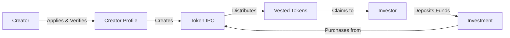
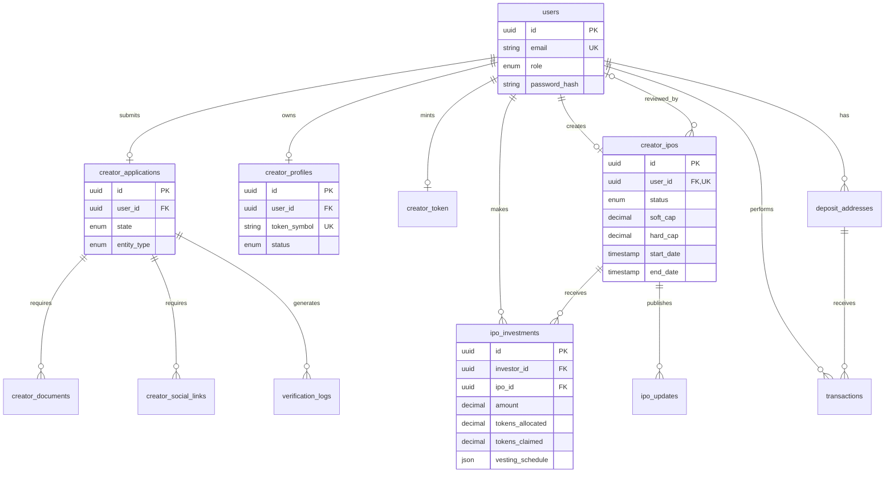
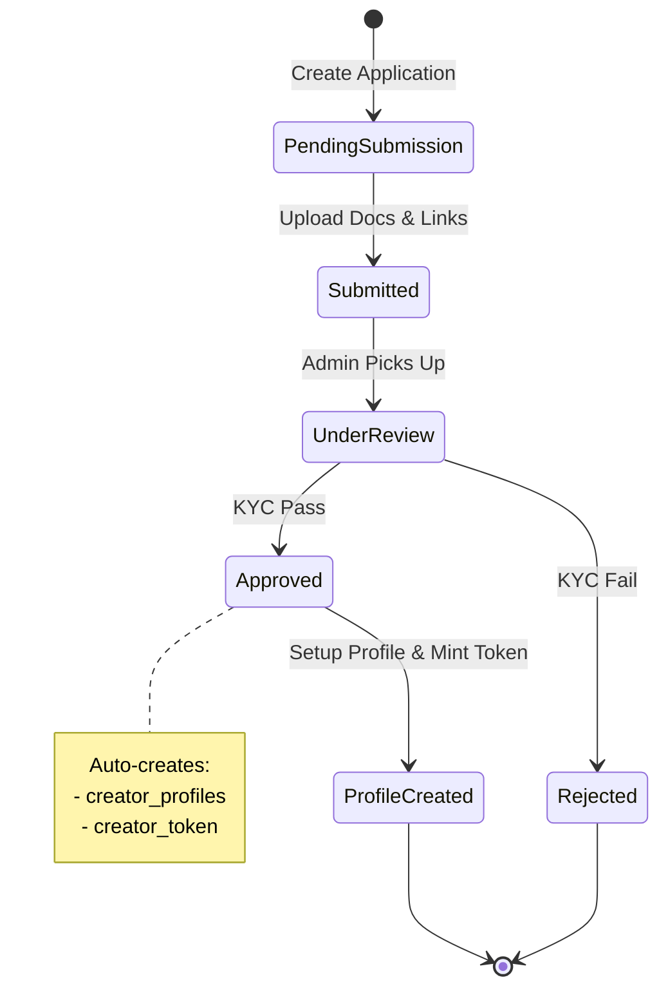
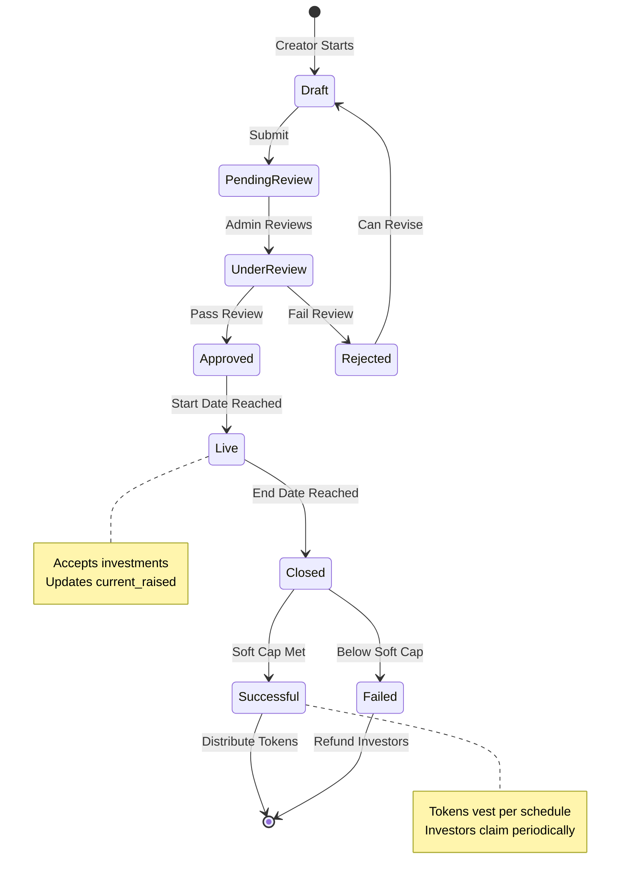
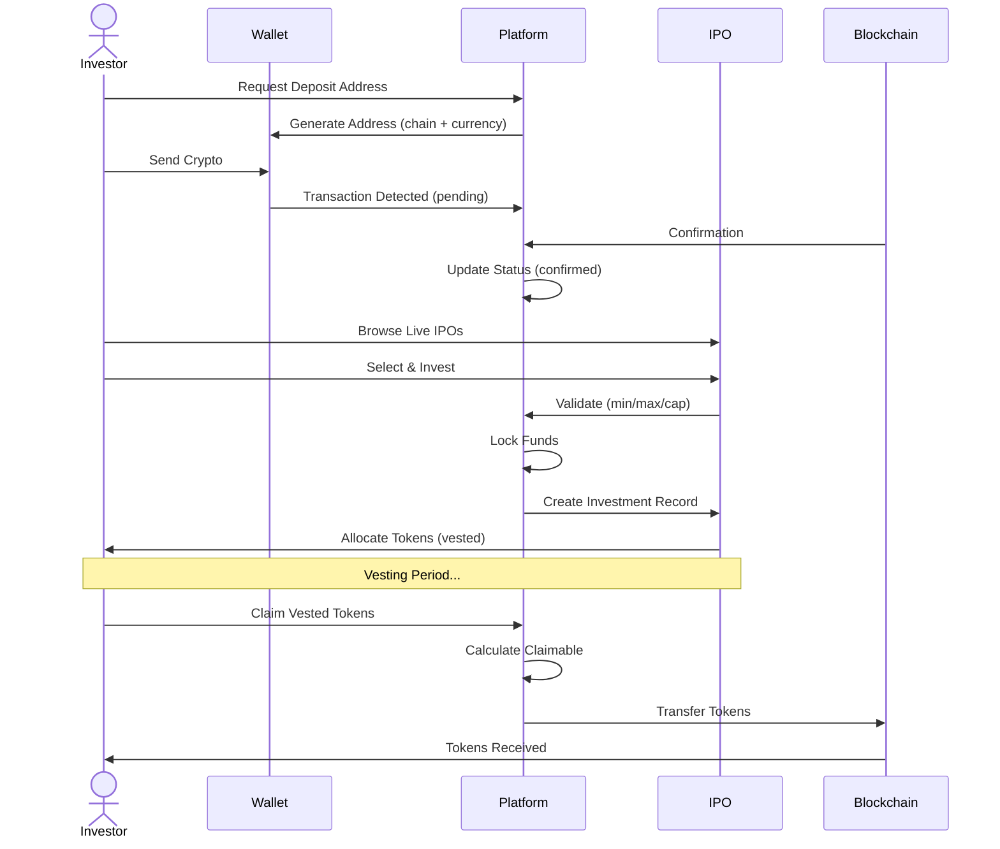

# Creator Token Platform - Database Design

> A comprehensive database schema for a creator token IPO platform with KYC verification, multi-chain deposits, and vesting schedules.

## 🎯 Core Concept

Creators launch token IPOs → Investors fund projects → Tokens vest over time



## 📊 Entity Relationship Diagram



## 🔄 Core Workflows

### Creator Journey



### IPO Lifecycle



### Investment Flow



## 🗂️ Data Model Groups

### 1. User Management
| Table | Purpose | Key Constraint |
|-------|---------|----------------|
| `users` | Core auth & user data | `email` unique |

**Roles:** `investor` \| `creator` \| `admin`

### 2. Creator Verification
| Table | Purpose | Key Status |
|-------|---------|------------|
| `creator_applications` | KYC/KYB application | `state` enum |
| `creator_documents` | Document uploads | `status` enum |
| `creator_social_links` | Social verification | `verified` bool |
| `verification_logs` | Audit trail | - |

**Application States:** 
```
pending_submission → submitted → under_review → approved/rejected
```

### 3. Creator Assets
| Table | Purpose | Unique Key |
|-------|---------|------------|
| `creator_profiles` | Public creator info | `user_id`, `token_symbol` |
| `creator_token` | Blockchain token data | `user_id`, `mintAddress` |

### 4. IPO System
| Table | Purpose | Unique Key |
|-------|---------|------------|
| `creator_ipos` | Token offering config | `user_id` (one per creator) |
| `ipo_investments` | Individual investments | - |
| `ipo_updates` | Creator announcements | - |

**Critical Fields:**
- **Caps:** `soft_cap` (min for success), `hard_cap` (max allowed)
- **Pricing:** `price_per_token`, `tokens_for_sale`
- **Timeline:** `start_date`, `end_date`
- **Vesting:** JSON schedule with cliff, duration, intervals

### 5. Financial System
| Table | Purpose | Unique Key |
|-------|---------|------------|
| `deposit_addresses` | Unique deposit addresses | `user_id` + `chain` + `currency` |
| `transactions` | All financial movements | - |

**Supported:**
- **Chains:** Solana, Ethereum, Polygon
- **Currencies:** USDC, SOL, ETH, BTC
- **Types:** deposit, withdrawal, transfer

## 🎮 Key Business Logic

### IPO Success Calculation
```typescript
// After end_date passes
const totalRaised = sumOf(ipo_investments.amount);

if (totalRaised >= ipo.soft_cap) {
  ipo.status = 'successful';
  // Distribute tokens per vesting_schedule
} else {
  ipo.status = 'failed';
  // Refund all investments
}
```

### Vesting Token Calculation
```typescript
interface VestingSchedule {
  cliff: number;        // Days before first claim
  duration: number;     // Total days
  intervals: number;    // Number of claim periods
}

// Example: 90-day cliff, 365-day duration, 12 intervals
// Tokens unlock monthly after 3-month cliff
const tokensPerInterval = tokens_allocated / intervals;
const intervalDays = duration / intervals;

// Claimable check
const daysSinceStart = today - investment.created_at;
if (daysSinceStart < cliff) return 0;

const elapsedIntervals = Math.floor((daysSinceStart - cliff) / intervalDays);
const unlocked = Math.min(elapsedIntervals * tokensPerInterval, tokens_allocated);
return unlocked - tokens_claimed;
```

### Investment Validation
```typescript
// Before creating investment
assert(ipo.status === 'live');
assert(amount >= ipo.min_purchase);
assert(amount <= ipo.max_purchase || !ipo.max_purchase);
assert(ipo.current_raised + amount <= ipo.hard_cap);
assert(userBalance >= amount);
assert(ipo.accepted_currencies.includes(currency));
```

## 🔐 Access Control Matrix

|  | Investor | Creator | Admin |
|---|:---:|:---:|:---:|
| Deposit funds | ✅ | ✅ | ✅ |
| Invest in IPOs | ✅ | ✅ | ✅ |
| Apply for verification | ❌ | ✅ | N/A |
| Create IPO | ❌ | ✅ | ✅ |
| Review applications | ❌ | ❌ | ✅ |
| Approve/Reject IPOs | ❌ | ❌ | ✅ |

## 🚀 Quick Start

```bash
# Install dependencies
npm install

# Setup environment
cp .env.example .env
# Configure DATABASE_URL

# Run migrations
npx prisma migrate dev

# Generate Prisma Client
npx prisma generate

# Seed data (optional)
npx prisma db seed
```

## 📝 Common Queries

### Get Live IPOs with Creator Info
```typescript
const liveIPOs = await prisma.creator_ipos.findMany({
  where: { status: 'live' },
  include: {
    user: {
      select: {
        creatorProfile: true,
        creatorToken: true
      }
    },
    _count: {
      select: { investments: true }
    }
  }
});
```

### Calculate User's Claimable Tokens
```typescript
const investments = await prisma.ipo_investments.findMany({
  where: { 
    investor_id: userId,
    ipo: { status: 'successful' }
  }
});

const claimable = investments.map(inv => ({
  ipoId: inv.ipo_id,
  allocated: inv.tokens_allocated,
  claimed: inv.tokens_claimed,
  available: calculateVestedAmount(inv) - inv.tokens_claimed
}));
```

### Get Creator's IPO Performance
```typescript
const performance = await prisma.creator_ipos.findUnique({
  where: { user_id: creatorId },
  include: {
    investments: {
      select: {
        amount: true,
        currency: true,
        tokens_allocated: true
      }
    },
    _count: {
      select: { investments: true }
    }
  }
});

const stats = {
  totalRaised: sumBy(performance.investments, 'amount'),
  investors: performance._count.investments,
  tokensSold: sumBy(performance.investments, 'tokens_allocated'),
  successRate: (performance.soft_cap / performance.hard_cap) * 100
};
```

## 📐 Design Patterns

### Single Table Inheritance
- `users` table serves all user types
- Role-based differentiation via `role` enum
- Related tables (creator_profiles, investments) join via FK

### Status State Machines
- Explicit status enums prevent invalid states
- Transitions controlled at application level
- Audit trails via timestamps and logs

### Soft Deletes
- Use `status: 'inactive'` instead of DELETE
- Maintains referential integrity
- Enables data recovery and audit

### JSON for Flexibility
- `vesting_schedule` - Custom vesting rules per IPO
- `milestones` - Dynamic goal tracking
- `use_of_funds` - Flexible allocation breakdowns
- `metadata` in logs - Extensible logging

---

**Schema Version:** 1.0.0  
**Last Updated:** December 2025